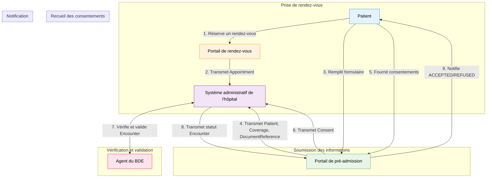

### Guide d’Implémentation FHIR – Pré-admission Hospitalière en Ligne

Bienvenue dans le guide d'implémentation FHIR pour la pré-admission hospitalière en ligne. Ce document est structuré en plusieurs sections afin de faciliter la compréhension et l'intégration des spécifications de notre IG.

---

#### Contexte et Objectif

##### Contexte

La pré-admission hospitalière est une étape administrative essentielle qui permet à l'établissement de santé de préparer l'accueil du patient en amont. Elle consiste à recueillir, à distance, les informations nécessaires pour :

- L’identification du patient,
- La gestion de sa couverture sociale,
- La collecte des documents justificatifs,
- Le recueil des consentements requis.

Ce guide s'appuie sur le standard **FHIR** afin d'assurer des échanges fluides, sécurisés et interopérables entre les différents systèmes impliqués, tout en respectant les contraintes réseau (pas d'accès direct au SIH depuis Internet) et en intégrant les retours manuels de l’agent administratif.

##### Objectif

Cette page décrit les échanges entre les différentes parties impliquées dans une **pré-admission hospitalière en ligne**. Elle définit notamment les spécifications d’échange de données entre :

- Un portail web de pré-admission,
- Un système de gestion des rendez-vous,
- Le système administratif de l'hôpital.

Les processus s’appuient sur les ressources FHIR définies dans cet IG.

---

#### Acteurs

| Acteur                                | Description                                                                 |
|---------------------------------------|-----------------------------------------------------------------------------|
|   **Patient**                        | Fournit ses informations de pré-admission via un portail en ligne.            |
|   **Portail de rendez-vous**          | Plateforme externe pour réserver des consultations ou des séjours.          |
|   **Portail de pré-admission**         | Plateforme en ligne (gérée par un tiers) pour recueillir les données administratives et médicales. |
|   **Système administratif de l'hôpital** | Système central de l’hôpital pour gérer les données administratives.         |
|   **Agent du Bureau des Entrées (BDE)**  | Vérifie et valide manuellement les informations reçues.                      |

---

#### Scénario Global des Flux

##### 1. **Prise de rendez-vous**

- **Acteurs impliqués** : Patient, Portail de rendez-vous, Système administratif de l'hôpital.
- **Description** :  
  Le patient réserve une consultation ou un séjour via un portail externe. Une ressource `Appointment` est créée dans le Portail de rendez-vous et transmise ensuite au système administratif de l'hôpital pour planifier l'accueil.
- **Ressources utilisées** :
  - `Appointment` : Informations sur la planification (date, heure, participants, motif).
  - `Consent` : Recueil des consentements associés.
  - `QuestionnaireResponse` : Réponses au questionnaire de prise de rendez-vous.
  - `Patient` : Identification du patient.

**Schéma :**

```plaintext
Patient → [Portail de rendez-vous] → Système administratif de l'hôpital
```

---

#### 2. **Soumission des informations de préadmission**

- **Acteurs impliqués** : Patient, Portail de préadmission, Système administratif de l'hôpital.
- **Description** : Le patient remplit un formulaire de préadmission sur le portail de préadmission. Les informations administratives (identité, couverture sociale, etc.) et les documents justificatifs (carte d’identité, carte Vitale, etc.) sont collectés.
- **Ressources utilisées** :
  - `Patient` : Contient les informations administratives du patient.
  - `Coverage` : Référence les informations sur la couverture sociale (AMO/AMC).
  - `DocumentReference` : Contient les pièces justificatives téléversées par le patient.

**Schéma :**

```plaintext
Patient → [Portail de préadmission] → Système administratif de l'hôpital
```

---

#### 3. **Recueil des consentements**

- **Acteurs impliqués** : Patient, Portail de préadmission, Système administratif de l'hôpital.
- **Description** : Le patient donne son consentement pour le traitement de ses données personnelles (RGPD), l’accès au DMP, ou la transmission de données à des tiers. Ces consentements sont transmis au Système administratif de l'hôpital.
- **Ressources utilisées** :
  - Consent : Contient les informations sur les consentements recueillis (type, statut, règles applicables).

**Schéma :**

```plaintext
Patient → [Portail de rendez-vous] → Système administratif de l'hôpital
```

OU

```plaintext
Patient → [Portail de préadmission] → Système administratif de l'hôpital
```

---

#### 4. **Vérification et validation par l’agent du BDE**

- **Acteurs impliqués** : Agent du BDE, Système administratif de l'hôpital.
- **Description** : L’agent du Bureau des Entrées (BDE) vérifie les informations transmises (documents, consentements, couverture sociale) et valide ou refuse la préadmission.
- **Ressources utilisées** :
  - `Encounter` : Contient les informations sur la préadmission (statut, patient, rendez-vous associé).

**Schéma :**

```plaintext
Système administratif de l'hôpital ↔ Agent du BDE
```

---

#### 5. Notification au patient

- **Acteurs impliqués** : Système administratif de l'hôpital, Portail de préadmission, Patient.
- **Description** : Une fois la préadmission validée ou refusée, le patient est notifié via le portail de préadmission. En cas de refus, le motif est communiqué.
- **Ressources utilisées** :
  - `Encounter` : Mise à jour du statut de la préadmission (ACCEPTED ou REFUSED). Un commentaire de l'agent du BDE peut être transmis.

**Schéma :**

```plaintext
SIH → [Portail de préadmission] → Patient
```

### Schéma global des flux

```plaintext
1. Prise de rendez-vous
   Patient → [Portail de rendez-vous] → Système administratif de l'hôpital

2. Soumission des informations de préadmission
   Patient → [Portail de préadmission] → Système administratif de l'hôpital

3. Recueil des consentements
   Patient → [Portail de préadmission] → Système administratif de l'hôpital

4. Vérification et validation par l’agent du BDE
   Système administratif de l'hôpital ↔ Agent du BDE

5. Notification au patient
   Système administratif de l'hôpital → [Portail de préadmission] → Patient
```



### Conclusion

Les flux décrits dans ce document permettent de coordonner efficacement l'échange d'informations entre les différents acteurs impliqués dans la pré-admission hospitalière. En s’appuyant sur les ressources FHIR telles que `Appointment`, `Patient`, `Coverage`, `DocumentReference`, `Consent`, `QuestionnaireResponse` et `Encounter`, ce processus vise à garantir à la fois la conformité réglementaire et une gestion efficace des données.