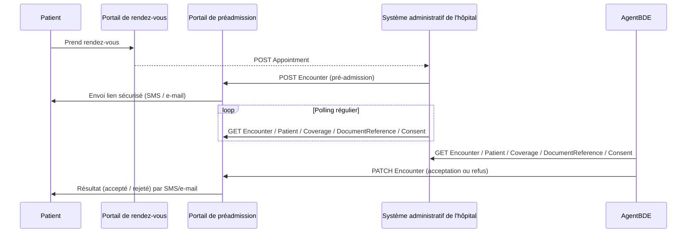
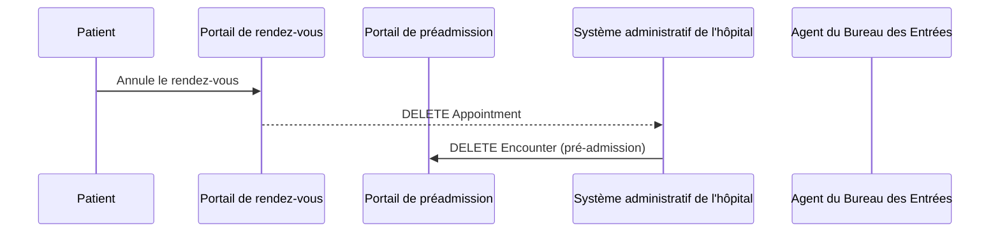

### Introduction

Ce guide présente le processus de préadmission hospitalière en ligne à travers les principales ressources FHIR utilisées. Chaque ressource est décrite avec son rôle, les interactions dans lesquelles elle est impliquée, et les contraintes spécifiques liées à son usage dans ce contexte.

---

### Appointment

**Rôle :** Prise de rendez-vous

- Créé lors de la demande de rendez-vous (plateforme ou secrétaire médicale).
- Peut contenir des extensions pour le type d’hospitalisation.
- Lien vers un ou plusieurs `QuestionnaireResponse` et `Consent`.

---

### Questionnaire / QuestionnaireResponse

**Rôle :** Recueil d'informations médicales préalables

- Utilisé pour collecter les informations comme la grossesse, les allergies, la présence de dispositifs médicaux, etc.
- Le `Questionnaire` est publié par l’hôpital.
- Le `QuestionnaireResponse` est rempli par le patient ou un professionnel.

---

### Consent

**Rôle :** Consentements RGPD et médicaux

- Permet d’indiquer :
  - Le consentement à la consultation du DMP.
  - Le consentement à la transmission de données à un portail externe.
  - Le traitement des données personnelles.
- Codé à l’aide du `PreadmissionCodeSystemConsentTypeFr`.

---

### Encounter

**Rôle :** Support de la préadmission

- Créé par le système administratif de l’hôpital après la réception du rendez-vous.
- Contient :
  - Le type d’hospitalisation (inpatient, outpatient, téléconsultation).
  - Des références à `Patient`, `Appointment`, `DocumentReference`, etc.
- Statut mis à jour selon la validation ou le rejet de la préadmission.

---

### DocumentReference

**Rôle :** Pièces justificatives du patient

- Chaque document téléversé est représenté par une ressource `DocumentReference`.
- Codé selon `PreadmissionCodeSystemDocumentTypeFr` (CNI, carte vitale, mutuelle, etc.).
- Contient un lien vers le fichier binaire (`Attachment`).

---

### Patient

**Rôle :** Informations personnelles

- Le patient est le sujet central de la préadmission.
- Les données sont créées ou mises à jour par le portail (nom, prénom, numéro de sécurité sociale, coordonnées, personne à prévenir).

---

Ce découpage par ressource permet une implémentation modulaire, chaque acteur (portail, secrétariat, SIH) manipulant uniquement les ressources pertinentes à son rôle tout en respectant les standards FHIR.

### Enchainements

#### Séquence standard

#### Annulation

