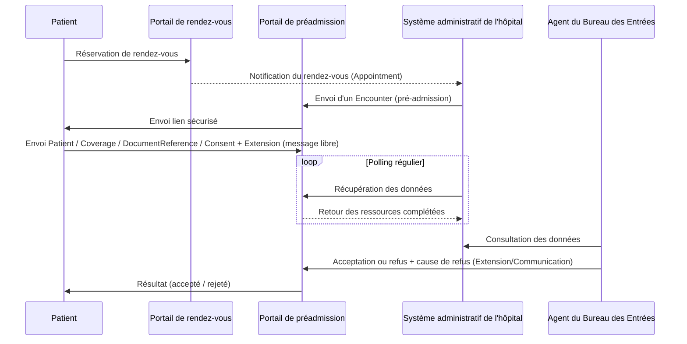
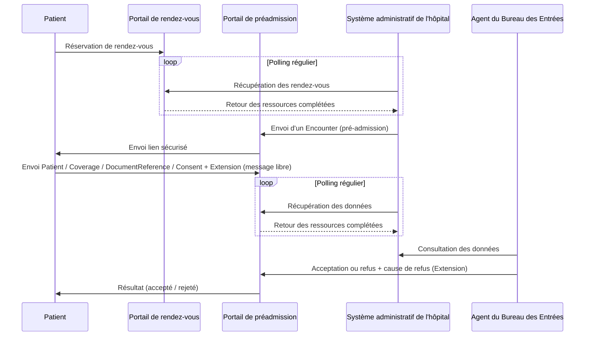
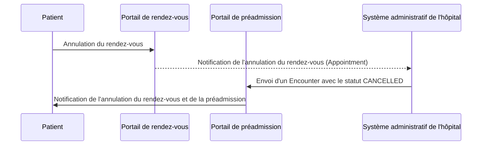

### Introduction

La pré-admission hospitalière en ligne repose sur une séquence d’opérations bien définies qui permettent la collecte et la validation des informations administratives nécessaires avant l’admission physique du patient à l’hôpital. Cette séquence est orchestrée par plusieurs acteurs du système de santé, chacun ayant un rôle spécifique à jouer dans le processus.

### Séquence des étapes

#### **Prise de Rendez-vous par le Patient**

Le patient réserve une consultation via un **portail externe**. Lors de cette prise de rendez-vous :

- Un `Appointment` est créé pour planifier la consultation.

#### **Remplissage du Formulaire de Pré-admission**

Une fois le rendez-vous pris, le patient remplit un formulaire de pré-admission via le **portail de préadmission**. Ce formulaire inclut des informations personnelles, des détails sur la couverture sociale, des documents justificatifs, ainsi que des consentements :

- Les données personnelles sont envoyées sous forme de `Patient`.
- Les documents justificatifs sont téléchargés sous forme de `DocumentReference`.
- Le consentement du patient est recueilli via une ressource `Consent`.

#### **Transmission des Données au Système administratif de l'hôpital**

Une fois les informations saisies et validées par le patient, le **Système administratif de l'hôpital** reçoit les données :

- Un `Encounter` de type préadmission est créé dans le **Système administratif de l'hôpital** pour amorcer le processus de validation des informations administratives.

#### **Vérification par le Bureau des Entrées (BDE)**

Un agent du **Bureau des Entrées (BDE)** vérifie les données récupérées, notamment :

- La validité des informations du patient.
- La conformité des documents justificatifs.
- La vérification de la couverture sociale.

Le BDE peut accepter ou refuser la pré-admission, et dans ce cas, une cause de rejet peut être spécifiée à l'aide d'une ressource `Extension`.

#### **Retour au Patient**
Après vérification, le **portail de préadmission** notifie le patient de l'issue de la pré-admission (acceptation ou rejet), avec des justifications éventuelles.

---

### Récapitulatif de la Séquence

| Étape                                       | Ressources FHIR utilisées                                               |
|--------------------------------------------|-------------------------------------------------------------------------|
| 1. Prise de rendez-vous                    | `Appointment`, `Patient`                                               |
| 2. Soumission des informations de pré-admission | `Patient`, `Encounter`                                                 |
| 3. Transmission au système administratif   | `Encounter`, `Patient`, `Coverage`, `DocumentReference`, `Consent`     |
| 4. Vérification et validation par le BDE   | `Encounter`                                                             |
| 5. Notification au patient                 | **SMS** ou **e-mail**                                                  |

---

### Diagramme de Séquence

Voici le diagramme de séquence Mermaid illustrant la procédure de pré-admission :

#### Si le Portail de rendez-vous est en dehors du SIH

#### Annulation de rendez-vous

### Conclusion

Cette séquence garantit une gestion fluide et structurée des données administratives liées à la pré-admission hospitalière en ligne. Chaque acteur du processus contribue à l'efficacité du parcours patient, tout en respectant les normes d'interopérabilité et de sécurité des données.

---
